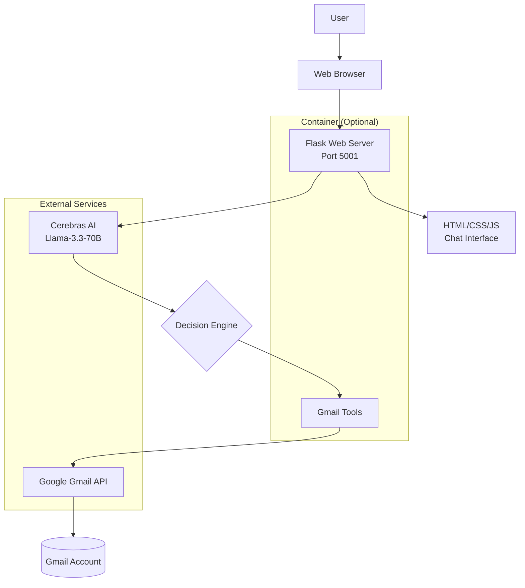

# System Architecture

## Overview
The Gmail Agent is a web-based AI-powered assistant that enables natural language interaction with Gmail through a chat interface. The system integrates AI decision-making with Gmail API operations to provide an intuitive email management experience.

## Architecture Diagram



## Data Flow

### 1. User Interaction
```
User Input → Web Browser → POST /chat → Flask Server
```

### 2. AI Processing
```
Flask Server → Cerebras API → JSON Response with Tool Call
```

### 3. Tool Execution
```
Tool Call → Gmail Tools → Google API → Email Data → Formatted Response
```

### 4. Response Delivery
```
Formatted Data → Flask Server → JSON Response → Web Browser → User Display
```

## Component Details

### Frontend (Web Browser)
- HTML/CSS/JS chat interface
- Sends user messages via AJAX to `/chat` endpoint
- Displays AI responses and tool outputs

### Backend (Flask Server)
- Handles HTTP requests
- Manages AI integration
- Executes Gmail operations
- Serves static web interface

### AI Layer (Cerebras)
- Interprets natural language requests
- Decides which Gmail tools to invoke
- Returns structured JSON responses

### Gmail Integration
- OAuth2 authentication
- API operations: list, search, draft emails
- Secure token management

### Container Layer (Docker)
- Optional containerization for consistent deployment
- Environment isolation
- Volume mounting for credentials persistence

## Security Considerations
- OAuth2 for Gmail access (read-only + compose scopes)
- API keys stored in environment variables
- No email sending without user confirmation
- Local token storage for authentication persistence